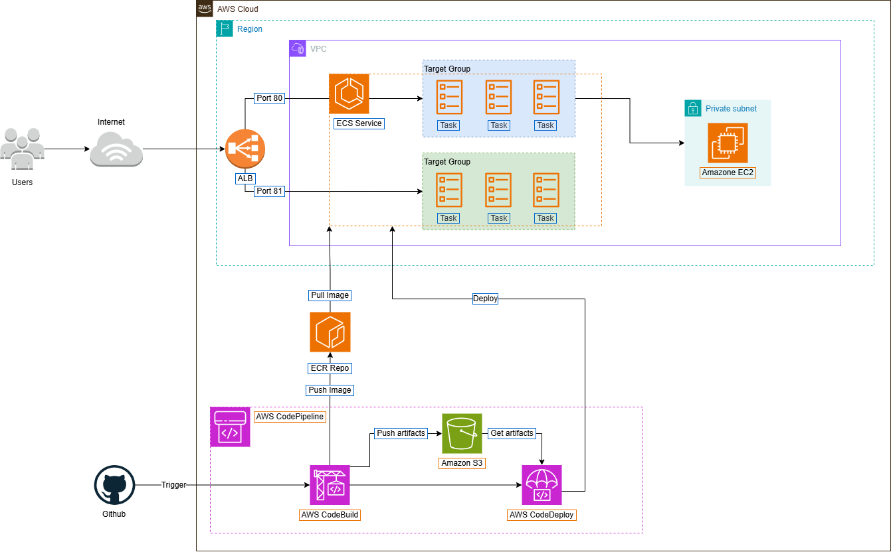

# Introduction 
Project: Deploying an Amazon ECS service using a blue/green deployment.
This project demonstrates the deployment of an ECS service using a blue/green deployment strategy. It is a personal project with a website that has been customized from my friend's code.

# Getting Started


# Steps to Follow:
- **Step 1:** Clone the GitHub repository.
    ```bash
    git clone https://github.com/5hry/e-commerce-web-bluegreen-deploy.git
    ```

- **Step 2:** Follow the steps in this [guide](http://ws-1.akaisme.click:8080/).

I have detailed the steps and necessary content in [this guide](http://ws-1.akaisme.click:8080/).
